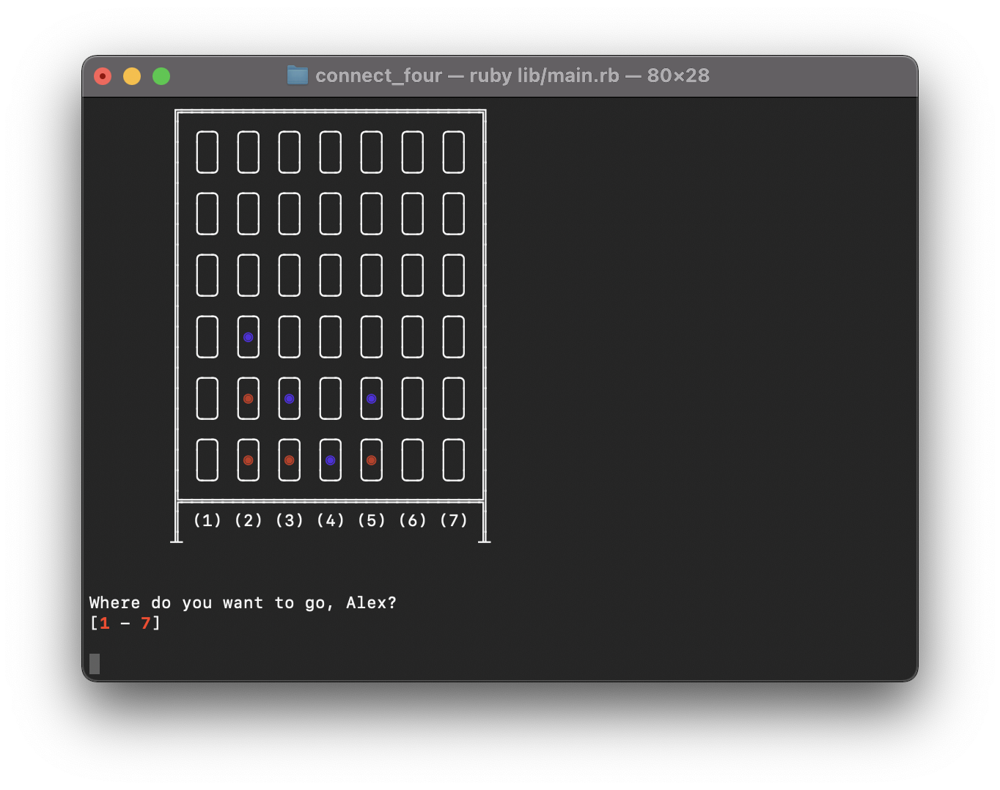

# Connect Four
A Connect Four game written in Ruby and playable in the command line.

## Description
This is a [Connect Four](https://en.wikipedia.org/wiki/Connect_Four) game which can be played by either two players, or by one player against a computer. There are *(will be)* multiple difficulties to play against the computer. You can also save your game to come back to it later.

### Media

## Install
...

## Usage
...

## Purpose
The purpose of this project was to practice programming using the test-driven development process.

## License
This project is licensed under the MIT License - see the LICENSE.txt file for details
